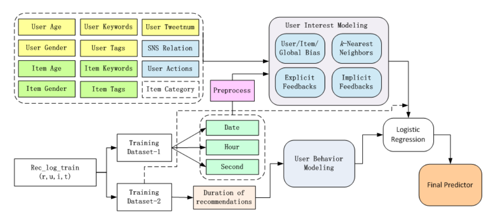

# User Interest Prediction

Final Project for *Data Mining Technology* 2019 Spring @ Fudan University, by [**Zuobai Zhang**](https://oxer11.github.io/)

## Introduction

As our final project for Data Mining course, this repository contains a simple solution to [KDD Cup 2012, Track 1](https://www.kaggle.com/c/kddcup2012-track1) competition. Given abundant data collected from Tencent Weibo, the main goal of this competition is to predict users' interests according to their previous behaviors. The prediction task involves predicting whether or not a user will follow an item that has been recommended to the user.

In order to solve this problem, we've combined **Latent Factor Model(LFM)** and **Pairwise Training** techiniques and then derived a effective solution. **AdaBoost** has also been invoked to improve the robustness of our algorithm. These algorithms has been implemented in *Julia v1.1.0*, a high-performance language for scientific computing.

## Methods

Our algorithm is a slight variation of the solution proposed in [Context-aware Ensemble of Multifaceted Factorization Models for Recommendation Prediction in Social Networks](https://pdfs.semanticscholar.org/46fd/d273e5798eb166915b302d39d36cce908e05.pdf). The steps of our exploration are listed as follow:
1. **Data Preprocessing**: Firstly, we filtered the dirty data via session analysis. Specifically, users may be attracted by something interesting on the Weibo website, and during these sessions, the recommended items were omitted by users. So eliminating these 'omitted' records from training dataset is an essential step. After that, we prepared positive-negative record pairs for pairwise training. The task was reformulated as a pairwise training job, which aimed to rank positive items higher than negative ones.
2. **User Interest Model**: Then, latent factor model was employed in our methods for the purpose of evaluating users' interests. We further adapted LFM by taking implicit feedback into consideration. As several other factors, such as date-time, user profile, keywords, tags, were incorporated, the prediction accuracy of our method has been effectively improved.
3. **User Behavior Model**: Moreover, we tried to estimate users' behavior by analyzing their duration on the website. The durations of users on each recommendation are very valuable clues to model users’ behaviors on social network website. For example, a user who was tweeting with friends and refreshing the page may have a shorter duration on the website than those who were reading the webpage carefully. However, the model performed far worse than expected. Thus, we abandoned this complicated but useless model.
4. **Ensemble Learning**: Typically, ensemble serves as the final step of data mining to improve the robustness of models. Here we utilized AdaBoost algorithm, which combined multiple 'weak classifiers' and assigned more weight to the classifiers with higher accuracy. Results showed that ensemble methods improved the performance significantly.

Additionally, owing to the lack of test mechanism, we have implemented a tester program by ourselves, which has been included in /test/ directory. The specifics of our algorithm can be found in our [report](doc/report/report.pdf).

## Conclusion

Finally, our approach obtained 0.42768(public score) / 0.41811(private score) on the testing dataset, which achieved the 5th place on the public leaderboard and the 3rd place on the private leaderboard. This excellent result arouses our enthusiasm of data mining and hope there will be another opportunities to participate in similar competitions.

## Acknowledgments

- Thanks to our teaching assistants for revising our work and her valuable advice.
- Thanks to my classmate [**Yuheng Zhang**](https://github.com/foolishhmy) for his discussion on the details about code reproduction.